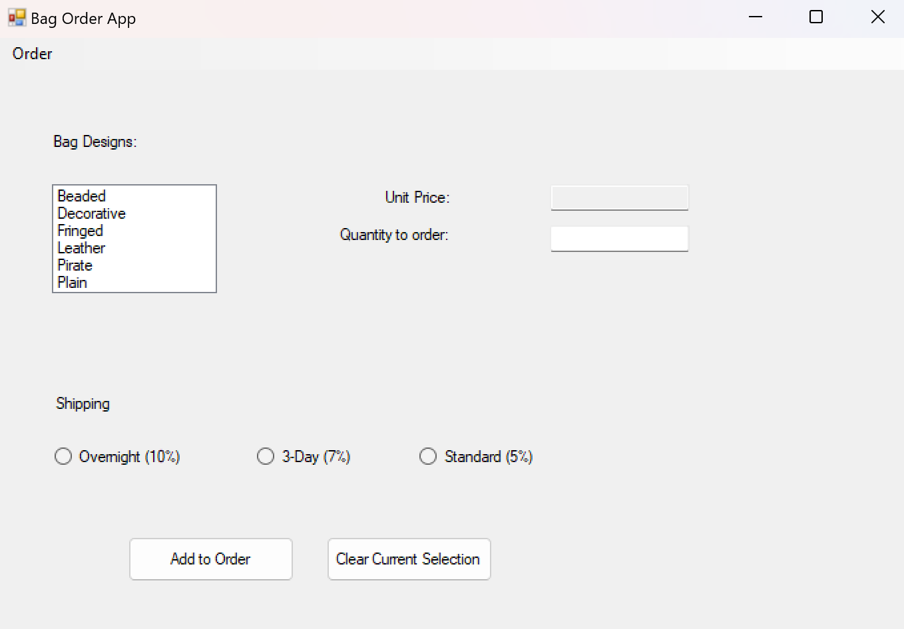
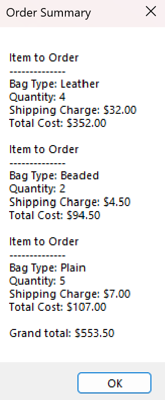

# Bag Order Management App

A **C# Windows Forms** application for managing bag orders, calculating costs, and displaying order summaries. This app provides an interactive interface for selecting bag designs, entering quantities, and applying shipping options.

## Features
- **Select Bag Designs:** Choose from multiple bag designs (Beaded, Decorative, Leather, etc.).
- **Order Quantity Input:** Enter the quantity of items to order.
- **Shipping Options:**
  - Overnight (10% charge)  
  - 3-Day (7% charge)  
  - Standard (5% charge)
- **Real-time Order Summary:** Automatically calculates total cost, including shipping.
- **Order Management:** Display, reset, and clear orders via the menu options.
- **Input Validation:** Prevents errors by checking for valid quantities and selections.

## Technologies Used
- C# with Windows Forms (.NET Framework)  
- Visual Studio IDE  
- GitHub for version control

## Installation and Setup

### Prerequisites
- Install **Visual Studio** (Community, Professional, or Enterprise) from [https://visualstudio.microsoft.com/](https://visualstudio.microsoft.com/).
- Ensure **.NET Framework** (version 4.7.2 or higher) is installed.

### Steps to Run the Application
1. **Clone the repository** to your local machine:
   ```bash
   git clone https://github.com/FadyMikhaeil/BagOrderManagementApp.git

## Screenshots

1. **Main Interface:**
   

2. **Order Summary:**
   

## Contact

For questions or feedback, feel free to contact:

**Fady Mikhaeil**  
GitHub: [https://github.com/FadyMikhaeil](https://github.com/FadyMikhaeil)

---


